# Testprotokoll – Kundenstamm- und Länderverwaltung

**Datum:** 19.02.2026  
**Tester:** AI Agent  
**Anwendung:** Reisekostenabrechnung  
**Umgebung:** Localhost:3001 (Next.js Dev-Server)  
**Testbenutzer:** `buchhaltung` (Rolle: accounting), `testuser` (Rolle: employee)

---

## Zusammenfassung

| Testfall | Ergebnis |
|---|---|
| TC-01 Login-Seite | ✅ Bestanden |
| TC-02 NavBar für Buchhaltung | ✅ Bestanden |
| TC-03 Länderverwaltung – Übersicht mit Seeding | ✅ Bestanden |
| TC-04 Länderverwaltung – Hinzufügen (Panel) | ✅ Bestanden |
| TC-05 Länderverwaltung – Hinzufügen (Speichern) | ✅ Bestanden |
| TC-06 Länderverwaltung – Zeilenauswahl | ✅ Bestanden |
| TC-07 Länderverwaltung – Bearbeiten (Panel) | ✅ Bestanden |
| TC-08 Länderverwaltung – Bearbeiten (Speichern) | ✅ Bestanden |
| TC-09 Länderverwaltung – Löschen | ✅ Bestanden |
| TC-10 Kundenstamm – Übersicht (leer) | ✅ Bestanden |
| TC-11 Kundenstamm – Hinzufügen (Panel) | ✅ Bestanden |
| TC-12 Kundenstamm – Formular mit Land-Dropdown | ✅ Bestanden |
| TC-13 Kundenstamm – Hinzufügen (Speichern) | ✅ Bestanden |
| TC-14 Zugriffskontrolle (Employee-Rolle) | ✅ Bestanden |

**Gesamt: 14/14 bestanden – 0 Fehler**

---

## Testfälle im Detail

### TC-01 – Login-Seite

**Ziel:** Login-Formular wird korrekt angezeigt.  
**Vorgehen:** Navigation zu `/login`.  
**Erwartetes Ergebnis:** Formular mit Benutzername-Feld und Anmelden-Button, Pflichtfeld in Gelb.  
**Ergebnis:** ✅ Korrekt angezeigt.  
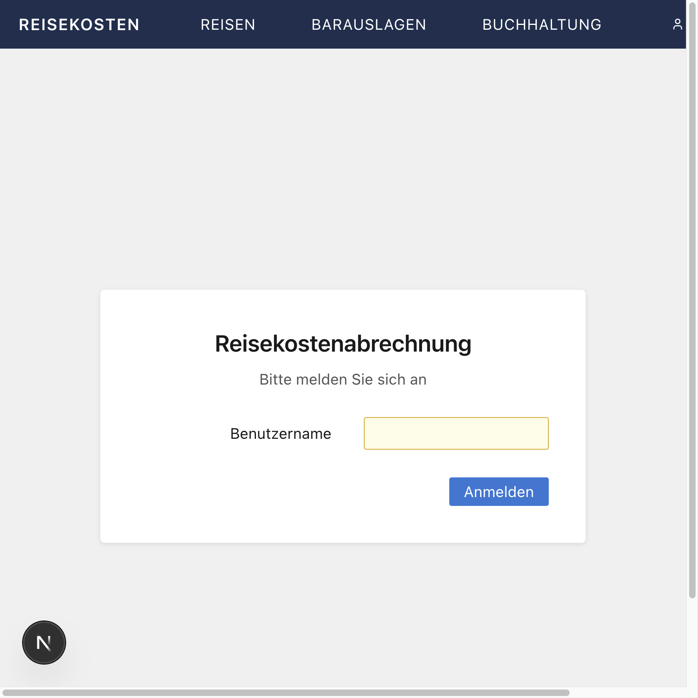

---

### TC-02 – NavBar für Buchhaltung-Benutzer

**Ziel:** Benutzer mit Rolle `accounting` sieht die Links "Kunden" und "Länder" in der Navigation.  
**Vorgehen:** Login mit `buchhaltung`, Startseite aufgerufen.  
**Erwartetes Ergebnis:** NavBar zeigt Reisen, Barauslagen, Buchhaltung, Kunden, Länder.  
**Ergebnis:** ✅ Alle 5 Links sichtbar.  
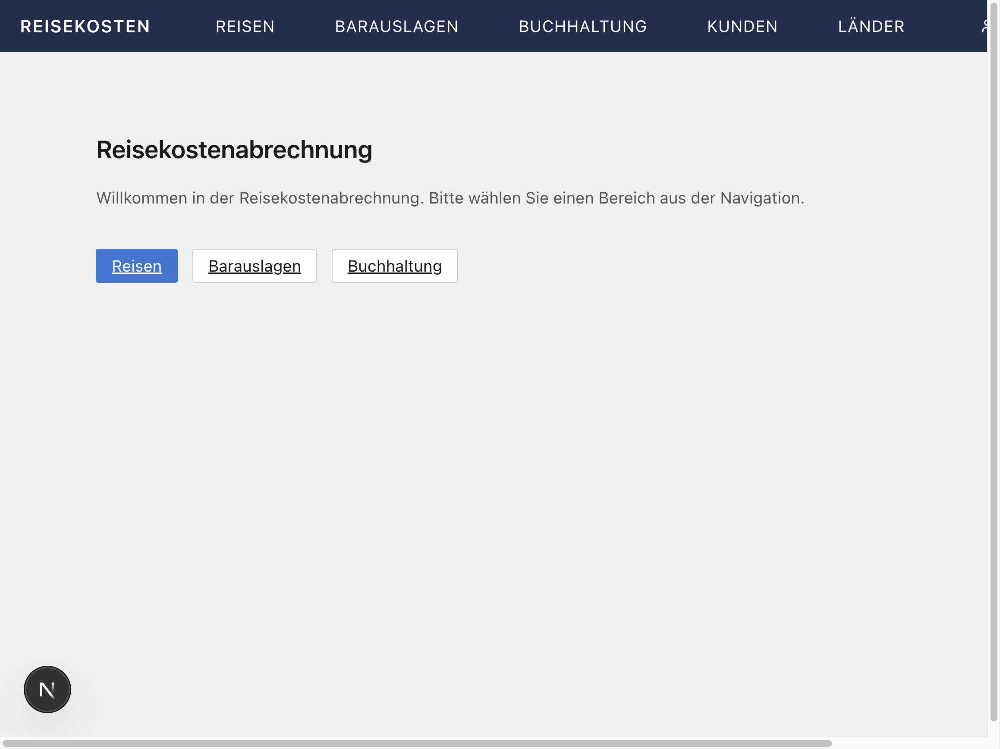

---

### TC-03 – Länderverwaltung – Übersicht mit Seeding

**Ziel:** Seite `/laender` zeigt die vordefinierten Länder aus dem DB-Seeding.  
**Vorgehen:** Navigation zu `/laender`.  
**Erwartetes Ergebnis:** Tabelle mit 9 Ländern (AT, CH, CZ, DE, FR, HU, IT, SI, SK), Toolbar mit deaktivierten Bearbeiten/Löschen-Buttons.  
**Ergebnis:** ✅ Alle 9 Länder angezeigt, alphabetisch sortiert nach Name. Toolbar-Buttons korrekt deaktiviert.  


---

### TC-04 – Länderverwaltung – Hinzufügen (Panel öffnen)

**Ziel:** Klick auf "Hinzufügen" öffnet das Slide-in-Panel.  
**Vorgehen:** Klick auf "Hinzufügen".  
**Erwartetes Ergebnis:** Panel mit Titel "LAND HINZUFÜGEN", Code-Feld (Pflicht, gelb), Name-Feld (Pflicht, gelb).  
**Ergebnis:** ✅ Panel öffnet korrekt, beide Pflichtfelder mit gelbem Hintergrund.  
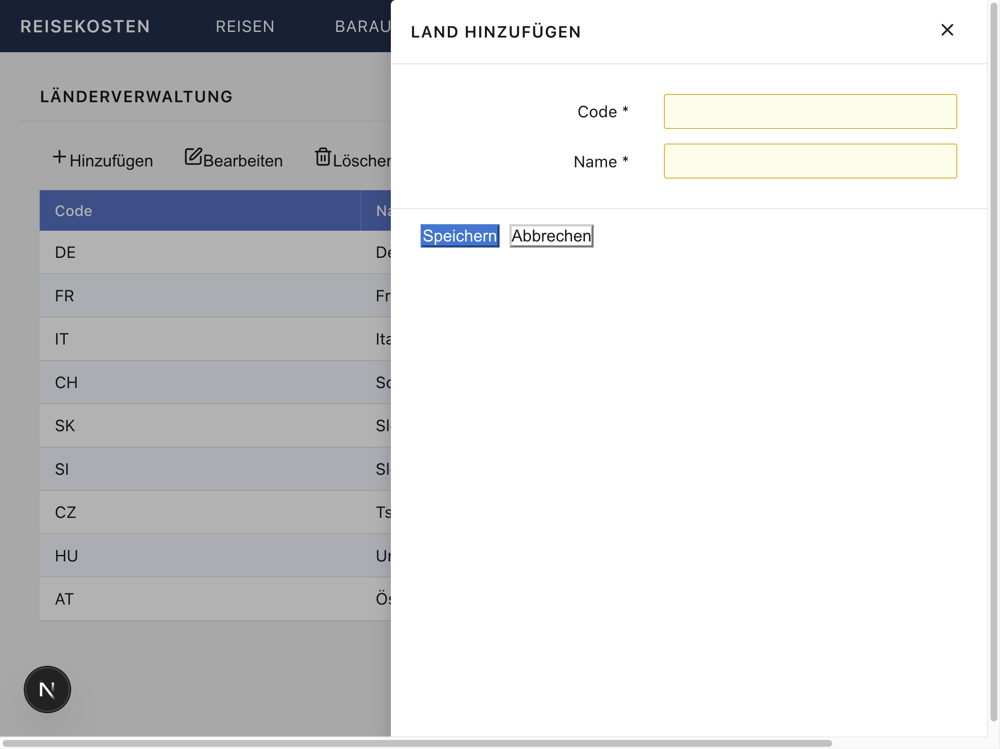

---

### TC-05 – Länderverwaltung – Hinzufügen (Speichern)

**Ziel:** Neues Land "PL – Polen" anlegen.  
**Vorgehen:** Code "PL", Name "Polen" eingegeben, "Speichern" geklickt.  
**Erwartetes Ergebnis:** Panel schließt, Tabelle zeigt neuen Eintrag "PL – Polen".  
**Ergebnis:** ✅ Eintrag korrekt gespeichert und in der Tabelle sichtbar.  
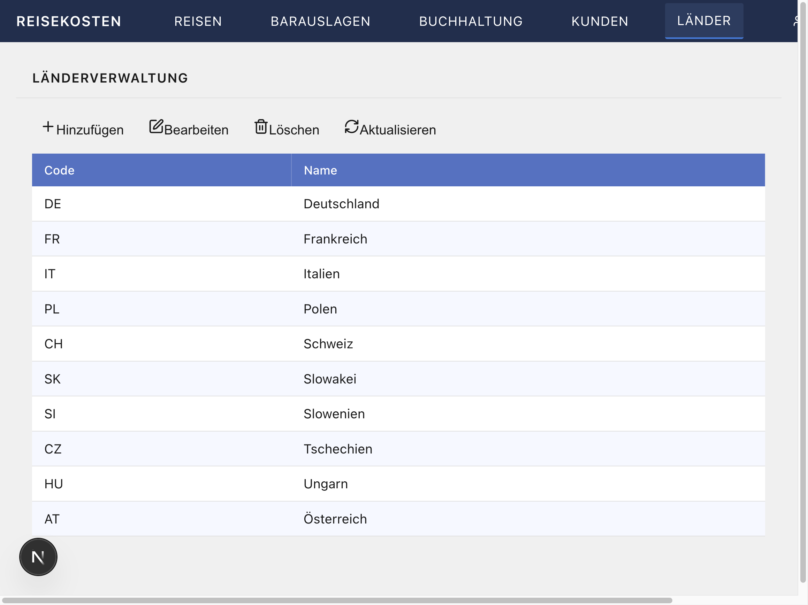

---

### TC-06 – Länderverwaltung – Zeilenauswahl

**Ziel:** Klick auf eine Zeile selektiert sie und aktiviert die Toolbar-Buttons.  
**Vorgehen:** Klick auf die Zeile "PL – Polen".  
**Erwartetes Ergebnis:** Zeile farblich hervorgehoben (blau), Bearbeiten- und Löschen-Button aktiviert.  
**Ergebnis:** ✅ Auswahl korrekt visualisiert und Buttons aktiviert.  
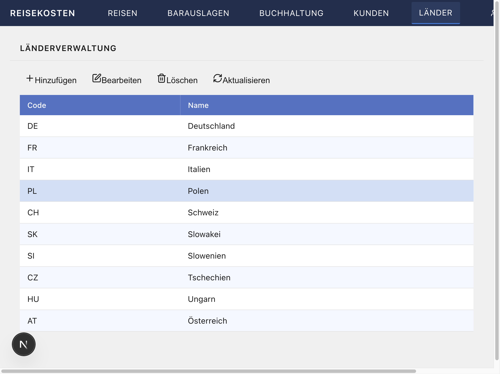

---

### TC-07 – Länderverwaltung – Bearbeiten (Panel öffnen)

**Ziel:** Klick auf "Bearbeiten" öffnet das Panel mit vorausgefüllten Daten.  
**Vorgehen:** Zeile "PL – Polen" ausgewählt, "Bearbeiten" geklickt.  
**Erwartetes Ergebnis:** Panel mit Titel "LAND BEARBEITEN", Felder vorausgefüllt mit "PL" und "Polen".  
**Ergebnis:** ✅ Panel öffnet korrekt mit den bestehenden Werten.  
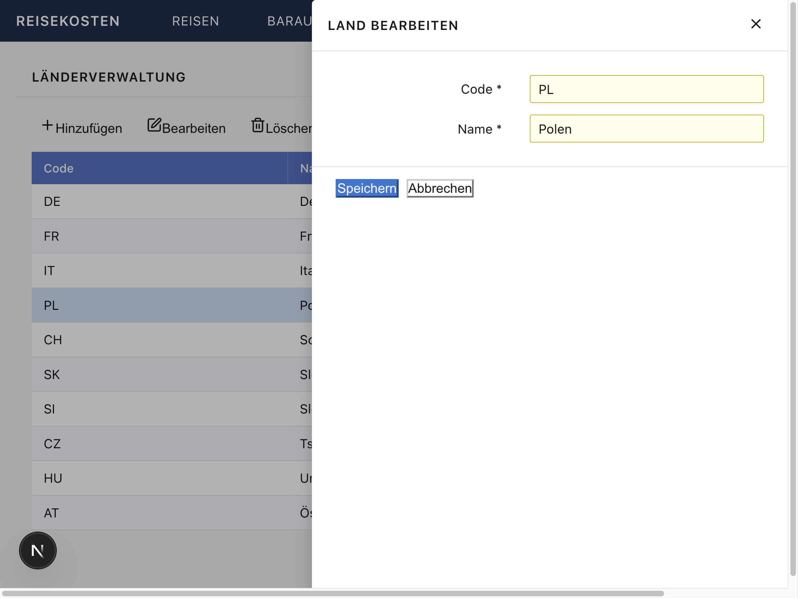

---

### TC-08 – Länderverwaltung – Bearbeiten (Speichern)

**Ziel:** Bearbeitung eines Landes wird korrekt gespeichert.  
**Vorgehen:** Name auf "Polen (geändert)" geändert, gespeichert.  
**Erwartetes Ergebnis:** Tabelle zeigt den aktualisierten Namen.  
**Ergebnis:** ✅ Änderung korrekt persistiert.  
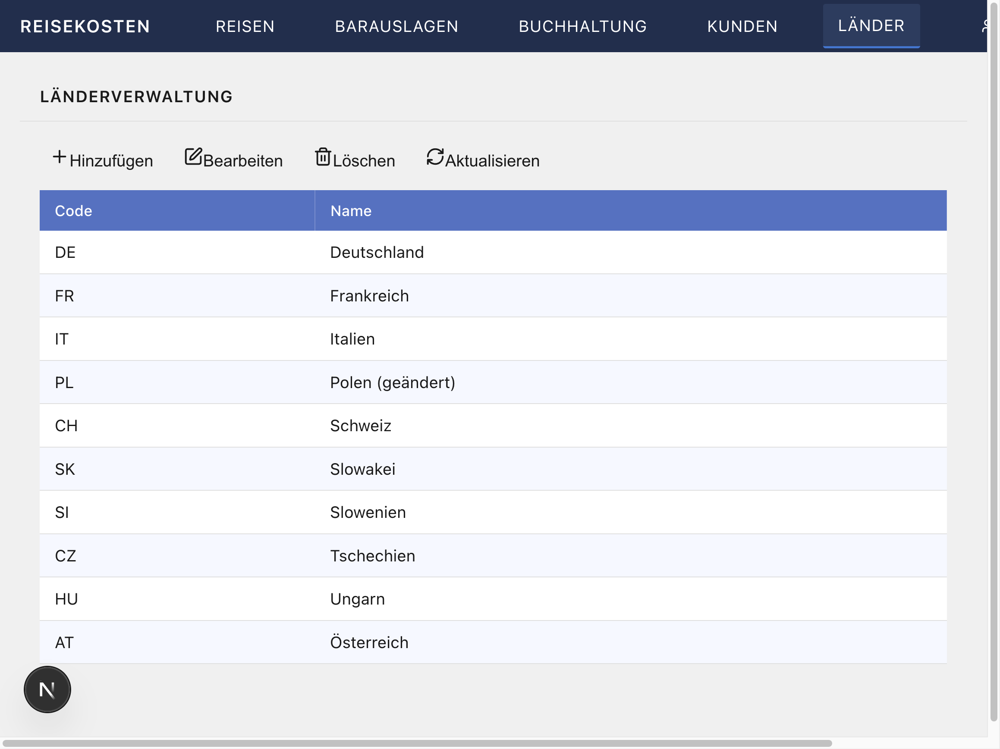

---

### TC-09 – Länderverwaltung – Löschen

**Ziel:** Land "PL – Polen (geändert)" kann gelöscht werden.  
**Vorgehen:** Zeile ausgewählt, "Löschen" geklickt, Bestätigungsdialog akzeptiert.  
**Erwartetes Ergebnis:** Eintrag wird aus der Tabelle entfernt, ursprüngliche 9 Länder bleiben.  
**Ergebnis:** ✅ Datensatz korrekt gelöscht.  


---

### TC-10 – Kundenstamm – Übersicht (leer)

**Ziel:** Seite `/kunden` zeigt leere Tabelle mit korrekten Spalten.  
**Vorgehen:** Navigation zu `/kunden`.  
**Erwartetes Ergebnis:** Tabelle mit Spalten Name, Kurzbezeichnung, Straße, PLZ + Ort, Land – ohne Einträge.  
**Ergebnis:** ✅ Korrekt angezeigt.  
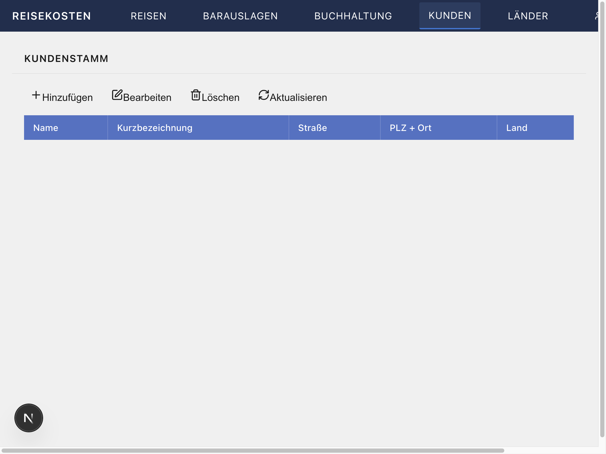

---

### TC-11 – Kundenstamm – Hinzufügen (Panel öffnen)

**Ziel:** Das Hinzufügen-Panel zeigt alle Felder inkl. Land-Dropdown.  
**Vorgehen:** Klick auf "Hinzufügen".  
**Erwartetes Ergebnis:** Panel mit Feldern Name (Pflicht), Kurzbezeichnung, Straße, PLZ, Ort, Land (Dropdown).  
**Ergebnis:** ✅ Alle Felder vorhanden. Dropdown enthält alle 9 Länder aus der Ländertabelle.  
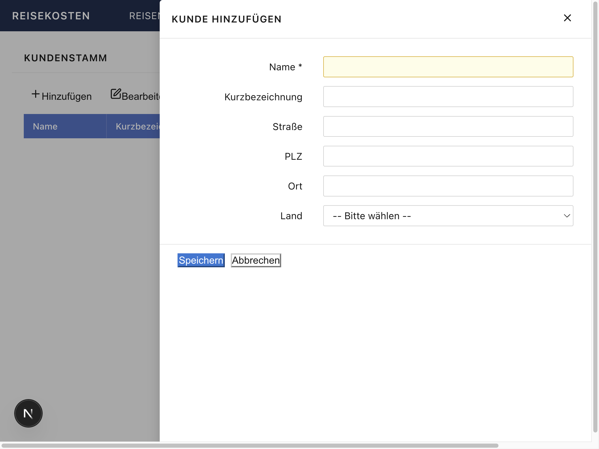

---

### TC-12 – Kundenstamm – Formular mit Land-Dropdown

**Ziel:** Alle Felder können befüllt werden, Land-Dropdown funktioniert.  
**Vorgehen:** Name "Musterfirma GmbH", Kurzbezeichnung "Muster", Straße "Hauptstraße 42", PLZ "1010", Ort "Wien", Land "Österreich" eingegeben.  
**Erwartetes Ergebnis:** Dropdown zeigt "Österreich" als gewählten Wert.  
**Ergebnis:** ✅ Alle Felder korrekt befüllbar, Dropdown-Auswahl funktioniert.  
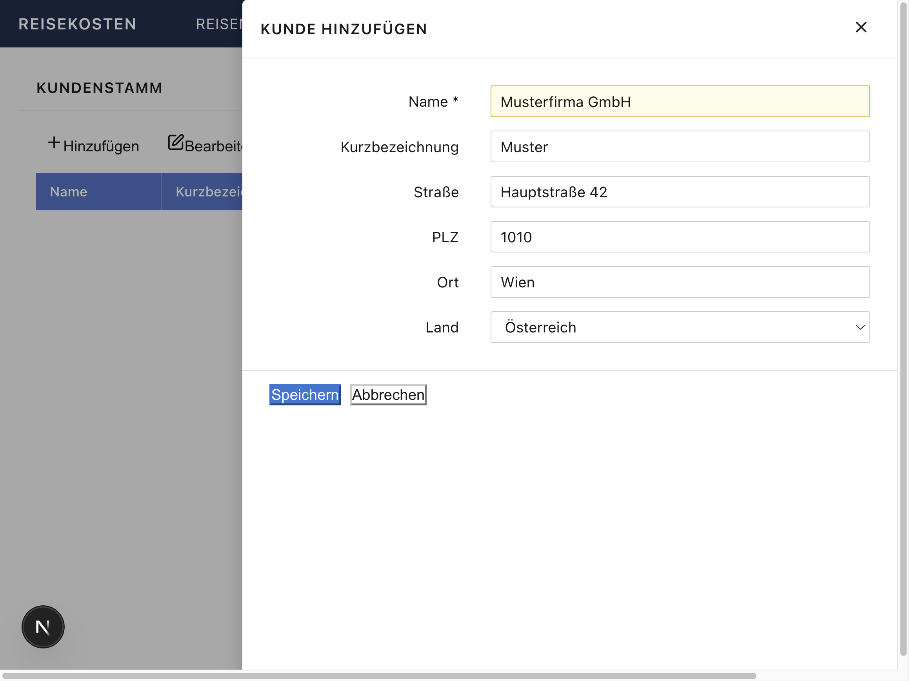

---

### TC-13 – Kundenstamm – Hinzufügen (Speichern)

**Ziel:** Neuer Kundendatensatz wird gespeichert und in der Tabelle angezeigt.  
**Vorgehen:** "Speichern" geklickt.  
**Erwartetes Ergebnis:** Tabelle zeigt "Musterfirma GmbH" mit allen Feldern, Land als Klartext "Österreich".  
**Ergebnis:** ✅ Datensatz korrekt gespeichert. PLZ und Ort werden als "1010 Wien" zusammengefasst.  
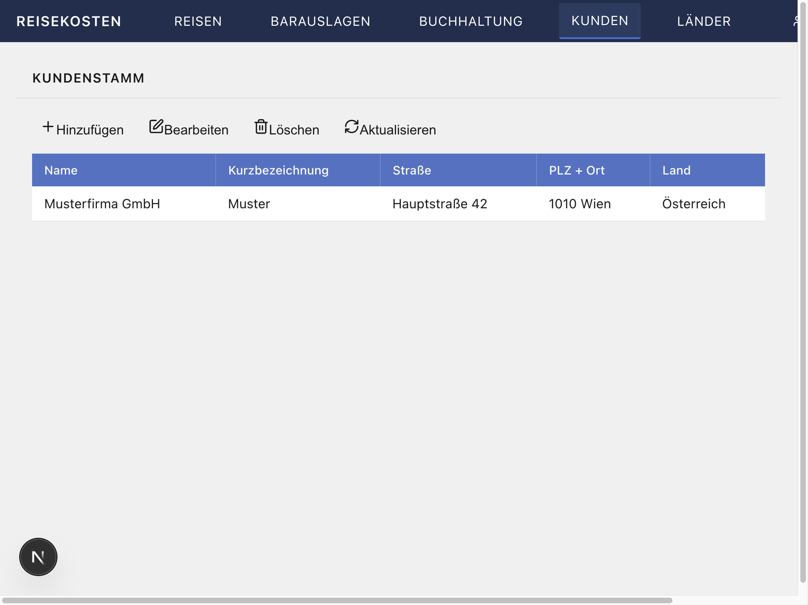

---

### TC-14 – Zugriffskontrolle (Employee-Rolle)

**Ziel:** Benutzer mit Rolle `employee` (kein Admin) kann `/kunden` und `/laender` nicht aufrufen.  
**Vorgehen:** Login mit `testuser` (employee), direkte Navigation zu `/kunden`.  
**Erwartetes Ergebnis:** Weiterleitung auf `/`, kein Kunden/Länder-Link in der NavBar.  
**Ergebnis:** ✅ Middleware leitet korrekt auf Startseite um. NavBar zeigt für `testuser` keine Kunden/Länder-Links.  
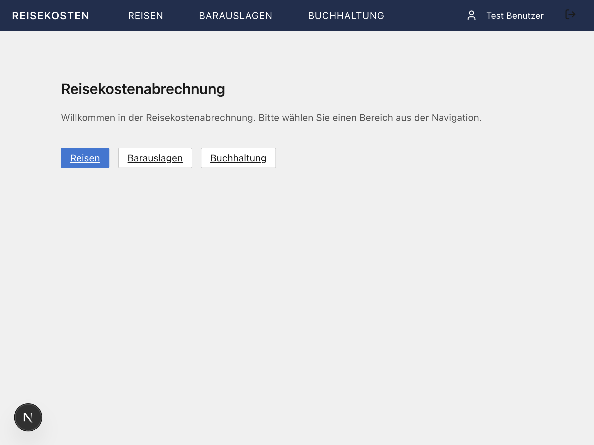

---

## Anmerkungen und Fixes während des Tests

### Bug behoben: Tabellenzeilen nicht im Accessibility Tree

- **Problem:** Tabellenzeilen (`<tr>`) hatten keinen semantischen Role und waren für Screenreader und Browser-Automatisierung nicht zugänglich.
- **Fix:** `role="button"`, `tabIndex={0}`, `aria-label` und `onKeyDown` zu allen Tabellenzeilen in `app/laender/client.tsx` und `app/kunden/client.tsx` hinzugefügt.
- **Auswirkung:** Verbesserte Barrierefreiheit und Keyboard-Navigation.

---

## Datenbankzustand nach Tests

```sql
-- Länder: 9 Einträge (vordefinierten Seeding-Daten, PL wurde angelegt und wieder gelöscht)
-- Kunden: 1 Eintrag (Musterfirma GmbH, Wien, Österreich)
```
